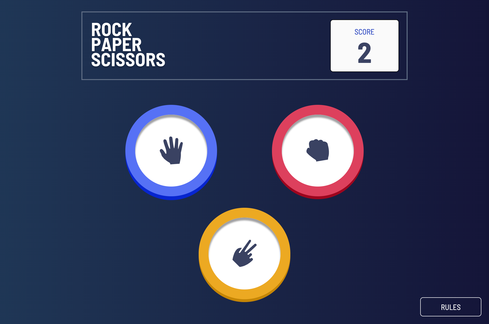

# Frontend Mentor - Rock, Paper, Scissors

## The challenge

Your challenge is to build out this Rock, Paper, Scissors game and get it looking as close to the design as possible.

You can use any tools you like to help you complete the challenge. So if you've got something you'd like to practice, feel free to give it a go.

Your users should be able to:

- View the optimal layout for the game depending on their device's screen size
- Play Rock, Paper, Scissors against the computer

## Screenshot

## Built with

- [React Js](https://reactjs.org/) - Javascript framework
- [Tailwindcss](https://tailwindcss.com) - For styling
- [React router](https://reactrouter.com/en/main) - For routing
- Mobile first design
- [CRA](https://create-react-app.dev/)
